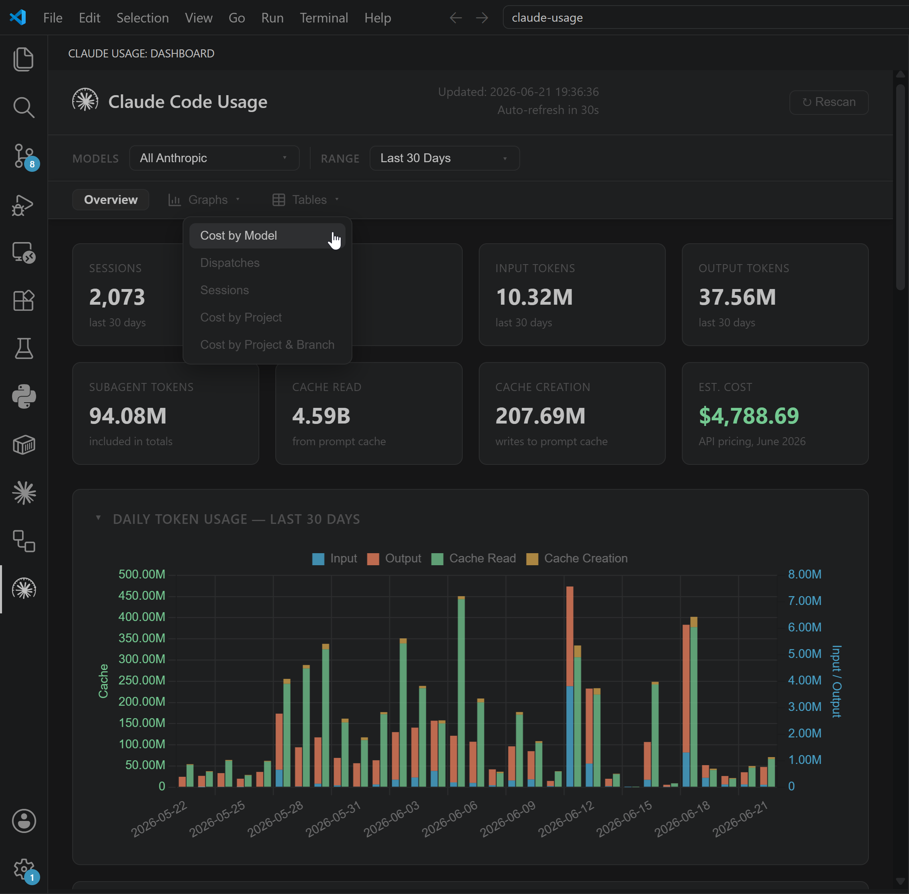
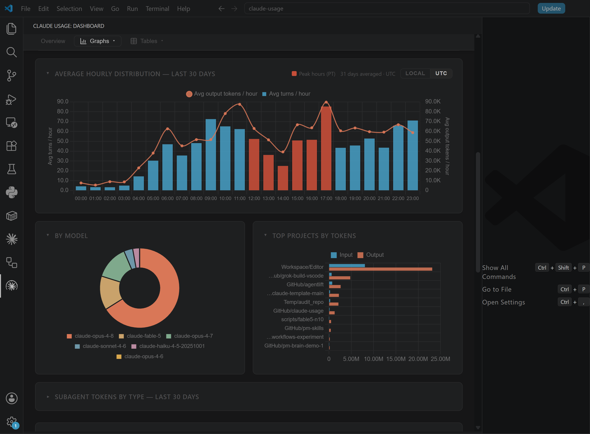
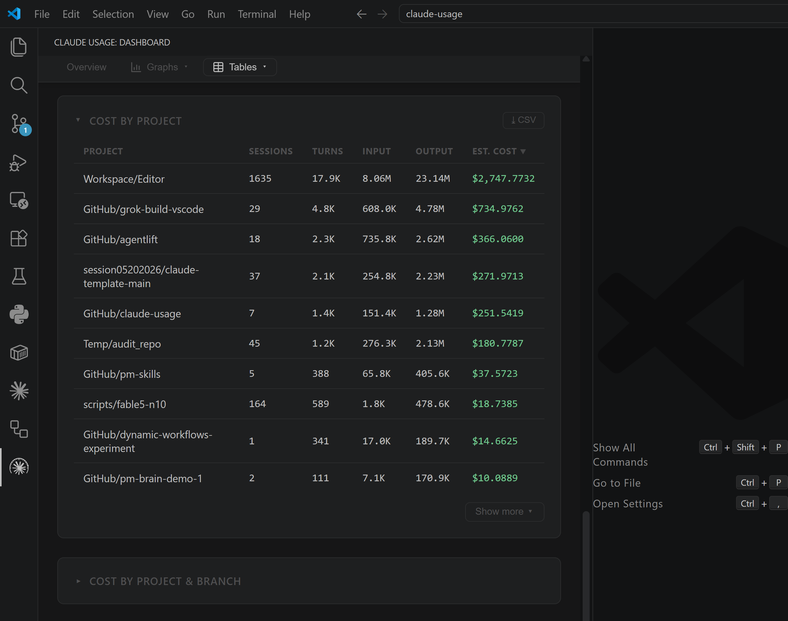

# Claude Code Usage Dashboard

[](LICENSE)
[](https://claude.ai/code)
[](https://github.com/phuryn/burnstop)

**Pro and Max subscribers get a progress bar. This gives you the full picture.**

Claude Code writes detailed usage logs locally — token counts, models, sessions, projects — regardless of your plan. This dashboard reads those logs and turns them into charts and cost estimates. Works on API, Pro, and Max plans.



Available as a **web app** (`python cli.py dashboard`) and as a [**VS Code extension**](https://marketplace.visualstudio.com/items?itemName=PawelHuryn.claude-usage-phuryn).

**Created by:** [The Product Compass Newsletter](https://www.productcompass.pm)

> **This is a fork.** Upstream is [phuryn/claude-usage](https://github.com/phuryn/claude-usage) (MIT, © Pawel Huryn), which is the origin of everything in this repository unless listed below. This fork adds:
>
> - **Plan limit tracking** (`limits.py`, `tests/test_limits.py`) — 5-hour session and weekly rate-limit indicators, with calibrated estimates when the usage API is unavailable
> - **Container deployment** (`Dockerfile`, `docker-compose.yml`, `docs/DOCKER.md`) — the dashboard as a loopback-only web app
> - The corresponding wiring in `cli.py` / `dashboard.py`
>
> Pricing tables and cost calculation are upstream code and are unmodified here; if a newly released model is missing from `PRICING`, its cost is reported as zero. Check the table before trusting a total.

---

## What this tracks

Works on **API, Pro, and Max plans** — Claude Code writes local usage logs regardless of subscription type. This tool reads those logs and gives you visibility that Anthropic's UI doesn't provide.

Captures usage from:
- **Claude Code CLI** (`claude` command in terminal)
- **VS Code extension** (Claude Code sidebar)
- **Dispatched Code sessions** (sessions routed through Claude Code)

**Not captured:**
- **Cowork sessions** — these run server-side and do not write local JSONL transcripts

---

## Requirements

- Python 3.8+
- No third-party packages — uses only the standard library (`sqlite3`, `http.server`, `json`, `pathlib`)

> Anyone running Claude Code already has Python installed.

## Quick Start

No `pip install`, no virtual environment, no build step.

### macOS / Linux (Homebrew)
```
brew tap phuryn/claude-usage https://github.com/phuryn/claude-usage
brew install phuryn/claude-usage/claude-usage
claude-usage dashboard
```

> Homebrew has disabled installing a formula from an arbitrary raw URL, so tap the repo first (thanks @adrianlungu for the working incantation in #46).

After install, the `claude-usage` command is on your `PATH` and accepts the same subcommands as `python cli.py` (`scan`, `today`, `stats`, `dashboard`).

### Any OS (uv tool / pipx)
```
uv tool install git+https://github.com/phuryn/claude-usage
claude-usage dashboard
```

Installs the `claude-usage` command without a clone (works with [`pipx`](https://pipx.pypa.io/) too: `pipx install git+https://github.com/phuryn/claude-usage`). The tool stays dependency-free — this only adds packaging metadata, no third-party runtime deps (#144).

### macOS / Linux (clone)
```
git clone https://github.com/phuryn/claude-usage
cd claude-usage
python3 cli.py dashboard
```

### Windows
```
git clone https://github.com/chiisanasoft/claude-usage
cd claude-usage
python cli.py dashboard
```

### Docker
```
git clone https://github.com/chiisanasoft/claude-usage
cd claude-usage
bash scripts/run-docker.sh
```

Opens the dashboard at **http://localhost:9898**.

The script builds the image, then runs the container with:
- `~/.claude` mounted **read-only** — the container can read your transcripts but cannot modify them
- A named Docker volume (`claude-usage-data`) for the SQLite database — persisted across restarts, isolated from your home directory

---

## Usage

> On macOS/Linux, use `python3` instead of `python` in all commands below. If you installed via Homebrew, replace `python cli.py` with `claude-usage`.

```
# Scan JSONL files and populate the database (~/.claude/usage.db)
python cli.py scan

# Show today's usage summary by model (in terminal)
python cli.py today

# Show the last 7 days (per-day breakdown + by-model totals)
python cli.py week

# Show all-time statistics (in terminal)
python cli.py stats

# Show the current 5-hour session + weekly limit indicators
python cli.py limits

# Scan + open browser dashboard at http://localhost:8080
python cli.py dashboard

# Custom host and port
python cli.py dashboard --host 0.0.0.0 --port 9000

# Environment variables are also supported
HOST=0.0.0.0 PORT=9000 python cli.py dashboard

# Scan a custom projects directory
python cli.py scan --projects-dir /path/to/transcripts
```

The scanner is incremental — it tracks each file's path and modification time, so re-running `scan` is fast and only processes new or changed files.

By default, the scanner checks both `~/.claude/projects/` and the Xcode Claude integration directory (`~/Library/Developer/Xcode/CodingAssistant/ClaudeAgentConfig/projects/`), skipping any that don't exist. Use `--projects-dir` to scan a custom location instead.

---

## Run in Docker

The dashboard can also run in a container — slim official Python base, no
dependencies to install, non-root user:

```
docker compose up -d --build     # then open http://127.0.0.1:8080
docker compose down              # stop (add -v to drop the database volume)
```

Your transcripts are mounted **read-only**, the derived SQLite DB lives in a
named volume, and the port is published to `127.0.0.1` only (the dashboard has
no authentication). One caveat: the live limits API reads an OAuth token from
the macOS keychain, which a Linux container cannot do. Your plan-limits settings
are mounted read-only instead, so the Plan Limits card still shows your plan and
**calibrated** percentages — run the dashboard natively for live ones. Run
`python cli.py limits` natively once before `docker compose up`, otherwise
Docker creates directories where those two settings files should be. Full
details: **[docs/DOCKER.md](docs/DOCKER.md)**.

---

## Plan limits (`limits`)

`python cli.py limits` reproduces the Claude desktop app's **Usage** screen in your terminal:

- **Current session (5h)** — the rolling 5-hour window containing your latest activity. Shows the dollar-equivalent consumed, the number of turns, a percentage bar and a "resets in" countdown.
- **Weekly — all models** — the 7-day window, same figures.
- **Weekly — Opus / Sonnet** — optional per-model rows, shown only when your plan actually has a separate sub-limit for that model (or, without the API, when there is local usage for it).

The percentage needs a cap that Anthropic doesn't publish and that isn't in the local logs, so it comes from one of three sources, in order of preference:

1. **Live API** — the read-only `/api/oauth/usage` endpoint, authenticated with the OAuth token Claude Code already stored (macOS keychain). It is an undocumented usage-status endpoint: it runs no inference, so it costs nothing and consumes none of your token budget. It is rate limited, so responses are cached briefly on disk and throttled requests fall back to the last good snapshot instead of dropping to a local-only estimate. Percentages and reset times then match the desktop app, and the caps are auto-calibrated in the background so estimates stay good later.
2. **Calibrated** — you tell it once what the desktop app shows (`--calibrate-session 20`) and the cap is backed out of your current consumption.
3. **Uncalibrated** — no cap known. Consumption and the reset countdown are still shown; the bar reads `—`.

If the plan shown is wrong — the keychain credential records the tier from when the token was issued, so it lags a plan change — set it explicitly with `python cli.py limits --set-plan "Max (20x)"` (`--set-plan auto` returns to auto-detection).

```
# Session + weekly indicators (runs an incremental scan first)
python cli.py limits

# Skip the API and use only local data / calibration
python cli.py limits --no-api

# Raw JSON payload (same shape the dashboard consumes)
python cli.py limits --json

# Skip the incremental scan (faster, but may miss very recent turns)
python cli.py limits --no-scan

# Calibrate a window against a percentage you read in the desktop app
python cli.py limits --calibrate-session 20
python cli.py limits --calibrate-weekly 40
python cli.py limits --calibrate-opus 15
python cli.py limits --calibrate-sonnet 35

# Anchor the weekly window to a fixed reset (DOW 0=Mon..6=Sun, local hour 0-23)
python cli.py limits --weekly-reset 3 11

# Diagnose the usage API (prints status, plan and hints — never your token)
python cli.py limits --debug-api
```

Settings persist in `~/.claude/claude-usage-limits.json` — detected plan, the caps for each window (with the time they were calibrated), the weekly reset anchor, and a `use_api` flag you can set to `false` to disable API calls permanently. Without a reset anchor the weekly window is a rolling 7 days.

The dashboard shows the same bars in a **Plan Limits** card at the top of the page, served by `GET /api/limits` and refreshed every 30 seconds.

---

## How it works

Claude Code writes one JSONL file per session to `~/.claude/projects/`. Each line is a JSON record; `assistant`-type records contain:
- `message.usage.input_tokens` — raw prompt tokens
- `message.usage.output_tokens` — generated tokens
- `message.usage.cache_creation_input_tokens` — tokens written to prompt cache
- `message.usage.cache_read_input_tokens` — tokens served from prompt cache
- `message.model` — the model used (e.g. `claude-sonnet-4-6`)

`scanner.py` parses those files and stores the data in a SQLite database at `~/.claude/usage.db`.

`dashboard.py` serves a single-page dashboard on `localhost:8080` with Chart.js charts (loaded from CDN). It auto-refreshes every 30 seconds and supports model filtering and a date-range dropdown with bookmarkable URLs. A sticky section nav jumps between sections, and every chart/table can be collapsed (remembered across reloads). The bind address and port can be configured with the `--host` and `--port` flags, or the `HOST` and `PORT` environment variables (defaults: `localhost`, `8080`).

---

## Cost estimates

Costs are calculated using **Anthropic API pricing as of June 2026** ([claude.com/pricing#api](https://claude.com/pricing#api)).

**Only models whose name contains `fable`, `mythos`, `opus`, `sonnet`, or `haiku` are included in cost calculations.** Local models, unknown models, and any other model names are excluded (shown as `n/a`).

| Model | Input | Output | Cache Write | Cache Read |
|-------|-------|--------|------------|-----------|
| claude-fable-5 | $10.00/MTok | $50.00/MTok | $12.50/MTok | $1.00/MTok |
| claude-mythos-5 | $10.00/MTok | $50.00/MTok | $12.50/MTok | $1.00/MTok |
| claude-opus-4-8 | $5.00/MTok | $25.00/MTok | $6.25/MTok | $0.50/MTok |
| claude-opus-4-7 | $5.00/MTok | $25.00/MTok | $6.25/MTok | $0.50/MTok |
| claude-opus-4-6 | $5.00/MTok | $25.00/MTok | $6.25/MTok | $0.50/MTok |
| claude-sonnet-4-6 | $3.00/MTok | $15.00/MTok | $3.75/MTok | $0.30/MTok |
| claude-haiku-4-5 | $1.00/MTok | $5.00/MTok | $1.25/MTok | $0.10/MTok |

> **Note:** These are API prices. If you use Claude Code via a Max or Pro subscription, your actual cost structure is different (subscription-based, not per-token).

---

## VS Code extension

If you'd rather see the dashboard inside your editor, the same UI is available as a VS Code extension. Same data, same charts, embedded as an activity-bar sidebar.

[**Install from the VS Code Marketplace →**](https://marketplace.visualstudio.com/items?itemName=PawelHuryn.claude-usage-phuryn)

[**See in Open VSX Registry →**](https://open-vsx.org/extension/PawelHuryn/claude-usage-phuryn)




The Python sources are bundled inside the `.vsix`, so the only end-user requirement is **Python 3.8+ on your `PATH`**. After install, click the gauge icon in the activity bar — the server spawns automatically and the dashboard renders in the sidebar.

See [vscode-extension/README.md](vscode-extension/README.md) for settings, commands, discovery order, and local-install instructions.

---

## Files

| File | Purpose |
|------|---------|
| `scanner.py` | Parses JSONL transcripts, writes to `~/.claude/usage.db` |
| `dashboard.py` | HTTP server + single-page HTML/JS dashboard |
| `cli.py` | `scan`, `today`, `week`, `stats`, `limits`, `dashboard` commands |
| `limits.py` | Session (5h) + weekly limit indicators, calibration, opt-in usage API |
| `Formula/claude-usage.rb` | Homebrew formula — install with `brew tap phuryn/claude-usage` then `brew install phuryn/claude-usage/claude-usage` |
| `vscode-extension/` | VS Code extension — embeds the dashboard inside VS Code |
| `Dockerfile` / `docker-compose.yml` | Container image and Compose stack (see [docs/DOCKER.md](docs/DOCKER.md)) |
| `scripts/run-docker.sh` | Build and run the dashboard in Docker with a read-only `~/.claude` mount |
